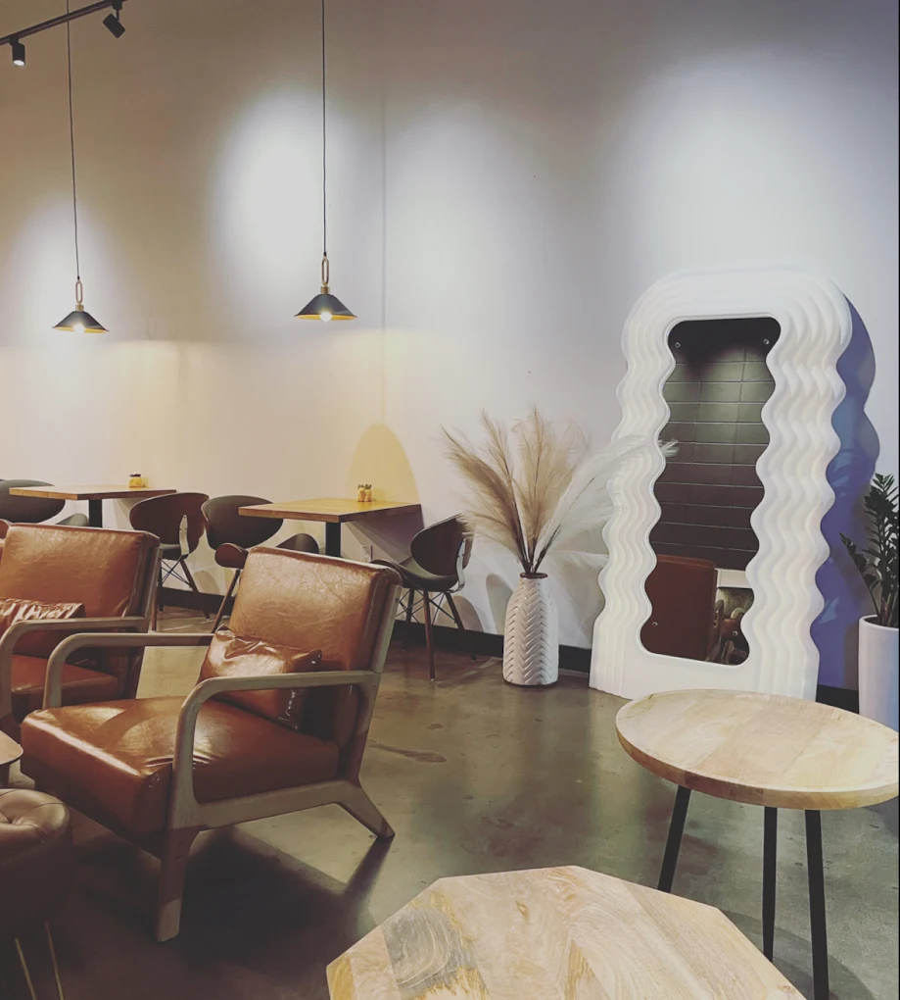

# RNY Coffee Studio Website

A modern, responsive single-page website for RNY Coffee Studio - a specialty coffee shop located in Koreatown, Los Angeles.

## 🌟 Overview

This is the official website for RNY Coffee Studio, featuring a minimalist design that showcases the coffee shop's offerings, location, and story. Built with React and styled with Tailwind CSS, the site provides a smooth, elegant user experience across all devices.

**Live Location**: 3829 W 6th St, Los Angeles, CA 90020

## ✨ Features

- **Hero Section**: Eye-catching landing page with call-to-action buttons for online ordering and location
- **About Section**: Story and philosophy of RNY Coffee Studio
- **Location Section**: Interactive Google Maps integration with business hours and contact information
- **Contact Form**: EmailJS integration for customer inquiries
- **Smooth Scroll Navigation**: Seamless transitions between sections
- **Responsive Design**: Mobile-first approach that works on all devices
- **Online Ordering**: Direct integration with Toast Tab ordering system
- **Social Media Integration**: Instagram profile link

## 🛠️ Tech Stack

- **Frontend Framework**: React 19.2.0
- **Styling**: Tailwind CSS 3.4.18
- **Icons**: React Icons 5.5.0
- **Email Service**: EmailJS (@emailjs/browser 4.4.1)
- **Routing**: React Router DOM 7.9.4
- **Build Tool**: Create React App (react-scripts 5.0.0)

## 📁 Project Structure

## 🚀 Getting Started

### Prerequisites

- Node.js (v14 or higher)
- npm or yarn

### Installation

1. Clone the repository:
git clone https://github.com/yourusername/rny.git
cd rny2. Install dependencies:
npm install
# or
yarn install3. Start the development server:
npm start
# or
yarn start

### Build for Production

npm run build
# or
yarn buildThis creates an optimized production build in the `build/` folder.

## 🎨 Key Components

### Navbar
Fixed navigation bar with responsive hamburger menu for mobile devices. Features smooth scrolling to different sections.

### Hero
Full-screen landing section with:
- Background image overlay
- Business tagline: "Roast with passion, yield with purpose"
- Quick action buttons (Order Now, Visit Us)

### About
Two-column layout showcasing:
- Company story and mission
- High-quality imagery
- Information about coffee sourcing and roasting process

### Location
Interactive section featuring:
- Embedded Google Maps
- Business hours
- Contact information
- Physical address

### Contact
Clean contact form with:
- Name, email, and message fields
- EmailJS integration for form submissions
- Instagram social link

## 📱 Responsive Design

The website is fully responsive with breakpoints:
- Mobile: < 768px
- Tablet: ≥ 768px (md)
- Desktop: ≥ 1024px (lg)

## 🔧 Configuration

### EmailJS Setup
To enable the contact form:
1. Create an account at [EmailJS](https://www.emailjs.com/)
2. Set up your email service
3. Update the EmailJS configuration in `src/sections/contact/Contact.jsx`

### Customization
- **Colors**: Modify `tailwind.config.js`
- **Images**: Replace images in `public/images/`
- **Content**: Update component files in `src/components/` and `src/sections/`

## 🧪 Testing

Run the test suite:
npm test
# or
yarn test## 📝 Available Scripts

- `npm start` - Runs the app in development mode
- `npm test` - Launches the test runner
- `npm run build` - Builds the app for production
- `npm run eject` - Ejects from Create React App (one-way operation)

## 🌐 External Integrations

- **Online Ordering**: [Toast Tab](https://order.toasttab.com/online/rny-coffee-studio-3829-west-6th-street)
- **Instagram**: [@rny_coffeestudio](https://instagram.com/rny_coffeestudio)
- **Google Maps**: Embedded location map

## 📄 License

This project is private and proprietary.

## 👥 Contact

**RNY Coffee Studio**
- Address: 3829 W 6th St, Los Angeles, CA 90020
- Phone: (213) 908-5141
- Instagram: [@rny_coffeestudio](https://instagram.com/rny_coffeestudio)

## 🙏 Acknowledgments

- Built with Create React App
- Styled with Tailwind CSS
- Icons from React Icons
- Email service by EmailJS

---

*Roast with passion, yield with purpose* ☕